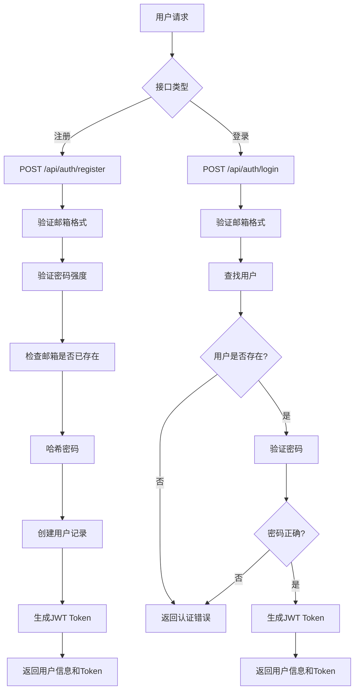

# 用户认证API详细实现计划

## 认证流程



## 具体实现细节

### 1. 工具函数实现

#### 密码工具 (`src/lib/auth/password.ts`)
```typescript
import bcrypt from 'bcrypt';

const SALT_ROUNDS = 10;

/**
 * 验证密码强度：至少8位，包含字母和数字
 */
export function validatePasswordStrength(password: string): boolean {
  if (password.length < 8) {
    return false;
  }
  
  // 检查是否包含字母和数字
  const hasLetter = /[a-zA-Z]/.test(password);
  const hasNumber = /\d/.test(password);
  
  return hasLetter && hasNumber;
}

/**
 * 哈希密码
 */
export async function hashPassword(password: string): Promise<string> {
  return await bcrypt.hash(password, SALT_ROUNDS);
}

/**
 * 验证密码
 */
export async function verifyPassword(
  password: string, 
  hashedPassword: string
): Promise<boolean> {
  return await bcrypt.compare(password, hashedPassword);
}
```

#### JWT工具 (`src/lib/auth/jwt.ts`)
```typescript
import jwt from 'jsonwebtoken';

const JWT_SECRET = process.env.JWT_SECRET || 'your-secret-key-change-in-production';
const JWT_EXPIRES_IN = process.env.JWT_EXPIRES_IN || '7d';

export interface JwtPayload {
  userId: string;
  email: string;
  iat?: number;
  exp?: number;
}

/**
 * 生成JWT token
 */
export function generateToken(userId: string, email: string): string {
  return jwt.sign(
    { userId, email },
    JWT_SECRET,
    { expiresIn: JWT_EXPIRES_IN }
  );
}

/**
 * 验证JWT token
 */
export function verifyToken(token: string): JwtPayload | null {
  try {
    return jwt.verify(token, JWT_SECRET) as JwtPayload;
  } catch (error) {
    return null;
  }
}

/**
 * 从请求头提取token
 */
export function extractTokenFromHeader(authHeader: string | null): string | null {
  if (!authHeader || !authHeader.startsWith('Bearer ')) {
    return null;
  }
  
  return authHeader.substring(7); // 移除 'Bearer ' 前缀
}
```

#### 验证工具 (`src/lib/auth/validation.ts`)
```typescript
/**
 * 验证邮箱格式
 */
export function validateEmail(email: string): boolean {
  const emailRegex = /^[^\s@]+@[^\s@]+\.[^\s@]+$/;
  return emailRegex.test(email);
}
```

### 2. 注册接口实现 (`src/app/api/auth/register/route.ts`)

```typescript
import { NextRequest, NextResponse } from 'next/server';
import { prisma } from '@/lib/prisma';
import { validateEmail } from '@/lib/auth/validation';
import { validatePasswordStrength, hashPassword } from '@/lib/auth/password';
import { generateToken } from '@/lib/auth/jwt';

export async function POST(request: NextRequest) {
  try {
    const body = await request.json();
    const { email, password } = body;

    // 验证请求体
    if (!email || !password) {
      return NextResponse.json(
        { success: false, error: '邮箱和密码是必填项' },
        { status: 400 }
      );
    }

    // 验证邮箱格式
    if (!validateEmail(email)) {
      return NextResponse.json(
        { success: false, error: '邮箱格式不正确' },
        { status: 400 }
      );
    }

    // 验证密码强度
    if (!validatePasswordStrength(password)) {
      return NextResponse.json(
        { success: false, error: '密码至少需要8位，且包含字母和数字' },
        { status: 400 }
      );
    }

    // 检查邮箱是否已存在
    const existingUser = await prisma.user.findUnique({
      where: { email },
    });

    if (existingUser) {
      return NextResponse.json(
        { success: false, error: '该邮箱已被注册' },
        { status: 409 }
      );
    }

    // 哈希密码
    const hashedPassword = await hashPassword(password);

    // 创建用户
    const user = await prisma.user.create({
      data: {
        email,
        password: hashedPassword,
        membershipTier: 'free',
      },
      select: {
        id: true,
        email: true,
        name: true,
        avatar: true,
        englishLevel: true,
        membershipTier: true,
        membershipExpiry: true,
        learningGoal: true,
        createdAt: true,
        updatedAt: true,
      },
    });

    // 生成JWT token
    const token = generateToken(user.id, user.email);

    // 返回响应
    return NextResponse.json(
      {
        success: true,
        message: '用户注册成功',
        data: {
          user,
          token,
        },
      },
      { status: 201 }
    );
  } catch (error) {
    console.error('注册错误:', error);
    return NextResponse.json(
      { success: false, error: '服务器内部错误' },
      { status: 500 }
    );
  }
}
```

### 3. 登录接口实现 (`src/app/api/auth/login/route.ts`)

```typescript
import { NextRequest, NextResponse } from 'next/server';
import { prisma } from '@/lib/prisma';
import { validateEmail } from '@/lib/auth/validation';
import { verifyPassword } from '@/lib/auth/password';
import { generateToken } from '@/lib/auth/jwt';

export async function POST(request: NextRequest) {
  try {
    const body = await request.json();
    const { email, password } = body;

    // 验证请求体
    if (!email || !password) {
      return NextResponse.json(
        { success: false, error: '邮箱和密码是必填项' },
        { status: 400 }
      );
    }

    // 验证邮箱格式
    if (!validateEmail(email)) {
      return NextResponse.json(
        { success: false, error: '邮箱格式不正确' },
        { status: 400 }
      );
    }

    // 查找用户
    const user = await prisma.user.findUnique({
      where: { email },
      select: {
        id: true,
        email: true,
        password: true,
        name: true,
        avatar: true,
        englishLevel: true,
        membershipTier: true,
        membershipExpiry: true,
        learningGoal: true,
        createdAt: true,
        updatedAt: true,
      },
    });

    // 检查用户是否存在
    if (!user) {
      return NextResponse.json(
        { success: false, error: '邮箱或密码错误' },
        { status: 401 }
      );
    }

    // 检查是否有密码（OAuth用户可能没有密码）
    if (!user.password) {
      return NextResponse.json(
        { success: false, error: '该账户未设置密码，请使用其他登录方式' },
        { status: 401 }
      );
    }

    // 验证密码
    const isPasswordValid = await verifyPassword(password, user.password);
    if (!isPasswordValid) {
      return NextResponse.json(
        { success: false, error: '邮箱或密码错误' },
        { status: 401 }
      );
    }

    // 生成JWT token
    const token = generateToken(user.id, user.email);

    // 移除密码字段
    const { password: _, ...userWithoutPassword } = user;

    // 返回响应
    return NextResponse.json(
      {
        success: true,
        message: '登录成功',
        data: {
          user: userWithoutPassword,
          token,
        },
      },
      { status: 200 }
    );
  } catch (error) {
    console.error('登录错误:', error);
    return NextResponse.json(
      { success: false, error: '服务器内部错误' },
      { status: 500 }
    );
  }
}
```

### 4. 认证中间件 (`src/lib/auth/middleware.ts`)

```typescript
import { NextRequest } from 'next/server';
import { verifyToken, extractTokenFromHeader } from './jwt';

export interface AuthContext {
  userId: string;
  email: string;
  isAuthenticated: boolean;
}

/**
 * 验证请求的认证状态
 */
export async function authenticateRequest(request: NextRequest): Promise<AuthContext> {
  const authHeader = request.headers.get('Authorization');
  const token = extractTokenFromHeader(authHeader);
  
  if (!token) {
    return { userId: '', email: '', isAuthenticated: false };
  }
  
  const payload = verifyToken(token);
  
  if (!payload) {
    return { userId: '', email: '', isAuthenticated: false };
  }
  
  return {
    userId: payload.userId,
    email: payload.email,
    isAuthenticated: true,
  };
}

/**
 * 保护API路由的中间件
 */
export async function withAuth(
  handler: (request: NextRequest, context: AuthContext) => Promise<Response>
) {
  return async (request: NextRequest) => {
    const authContext = await authenticateRequest(request);
    
    if (!authContext.isAuthenticated) {
      return new Response(
        JSON.stringify({ success: false, error: '未授权访问' }),
        { status: 401, headers: { 'Content-Type': 'application/json' } }
      );
    }
    
    return handler(request, authContext);
  };
}
```

### 5. 更新现有用户接口

需要修改 `src/app/api/users/me/route.ts` 以使用新的JWT认证：

```typescript
import { NextRequest, NextResponse } from 'next/server';
import { prisma } from '@/lib/prisma';
import { authenticateRequest } from '@/lib/auth/middleware';

export async function GET(request: NextRequest) {
  try {
    const authContext = await authenticateRequest(request);
    
    if (!authContext.isAuthenticated) {
      return NextResponse.json(
        { error: 'Unauthorized' },
        { status: 401 }
      );
    }

    const user = await prisma.user.findUnique({
      where: { id: authContext.userId },
      select: {
        id: true,
        email: true,
        name: true,
        avatar: true,
        englishLevel: true,
        membershipTier: true,
        membershipExpiry: true,
        learningGoal: true,
        createdAt: true,
        updatedAt: true,
      },
    });

    if (!user) {
      return NextResponse.json(
        { error: 'User not found' },
        { status: 404 }
      );
    }

    return NextResponse.json(user);
  } catch (error) {
    console.error('Error fetching user:', error);
    return NextResponse.json(
      { error: 'Internal server error' },
      { status: 500 }
    );
  }
}
```

## 依赖安装

需要安装以下npm包：

```bash
pnpm add bcrypt jsonwebtoken
pnpm add -D @types/bcrypt @types/jsonwebtoken
```

或者使用 `bcryptjs`（纯JavaScript实现，无需编译）：

```bash
pnpm add bcryptjs jsonwebtoken
pnpm add -D @types/bcryptjs @types/jsonwebtoken
```

## 环境变量配置

在 `.env.local` 中添加：

```env
# JWT配置
JWT_SECRET=your-super-secret-jwt-key-change-in-production
JWT_EXPIRES_IN=7d
```

## 测试用例

### 注册接口测试
```typescript
// 测试用例示例
describe('POST /api/auth/register', () => {
  it('应该成功注册新用户', async () => {
    const response = await request(app)
      .post('/api/auth/register')
      .send({
        email: 'test@example.com',
        password: 'Password123'
      });
    
    expect(response.status).toBe(201);
    expect(response.body.success).toBe(true);
    expect(response.body.data.user.email).toBe('test@example.com');
    expect(response.body.data.token).toBeDefined();
  });

  it('应该拒绝弱密码', async () => {
    const response = await request(app)
      .post('/api/auth/register')
      .send({
        email: 'test@example.com',
        password: '123' // 太短
      });
    
    expect(response.status).toBe(400);
    expect(response.body.success).toBe(false);
  });
});
```

## 部署检查清单

- [ ] 安装必要的依赖包
- [ ] 配置环境变量
- [ ] 创建必要的目录结构
- [ ] 实现工具函数
- [ ] 实现注册接口
- [ ] 实现登录接口
- [ ] 更新现有用户接口
- [ ] 测试所有接口
- [ ] 更新API文档

## 注意事项

1. **密码安全性**：使用bcrypt哈希密码，不要明文存储
2. **JWT安全**：使用强密钥，设置合理的过期时间
3. **错误信息**：不要泄露敏感信息（如用户是否存在）
4. **速率限制**：考虑添加API速率限制防止暴力破解
5. **CORS配置**：确保前端可以正确访问API
6. **日志记录**：记录重要的认证事件用于审计